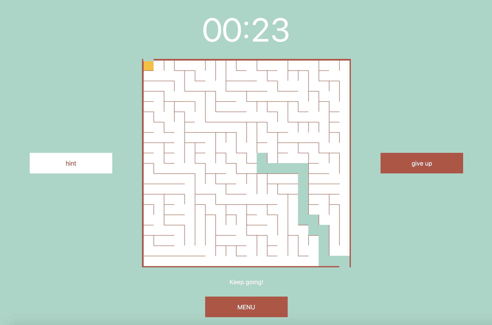
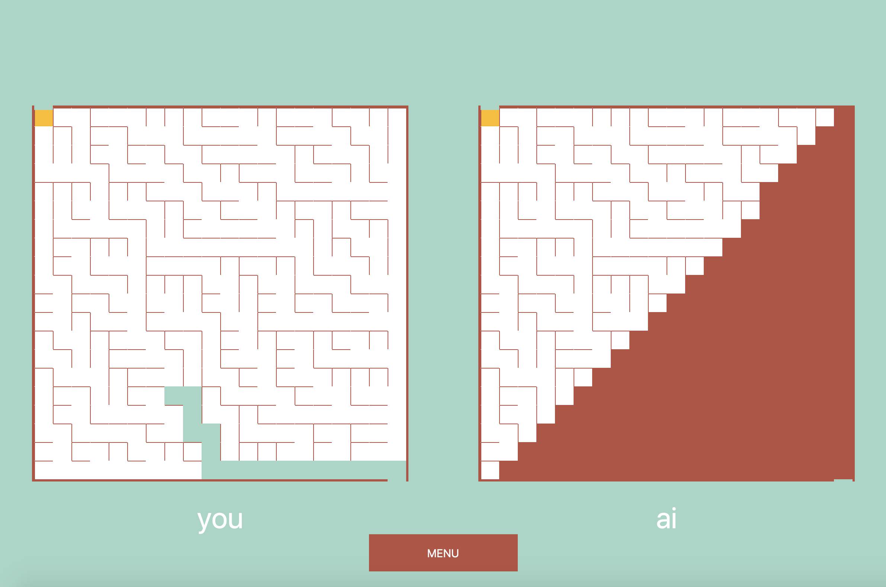

# 112 Term Project: MAZE

## Overview

MAZE is a game for solving randomly generated mazes. 

<b>Main Menu:<b>

 

<b>Randomly generated maze sample:<b>

 

<b>AI Mode:<b>

 

<b>User-solved maze sample:<b>

 

## Getting Started
  
Download all files (including CMU 112 graphics). In the editor, run the __main__.py file. 
  
Run on Python 3.9.6 64-bit.
  

